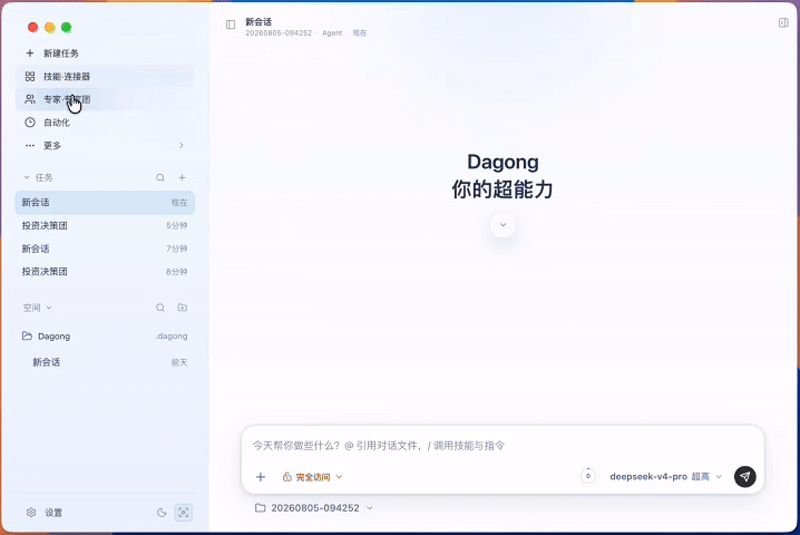
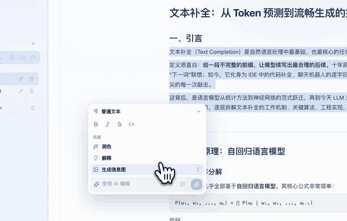
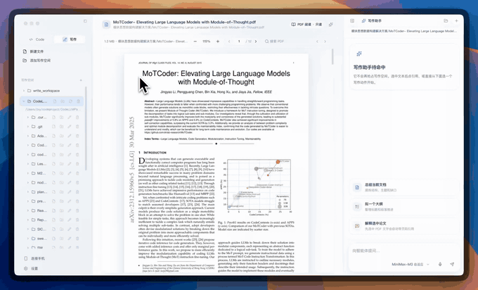

<p align="center">
  
</p>

<h1 align="center">MagicPocket</h1>

<p align="center">
  <strong>探索需求先行的下一代 coding 范式。</strong><br>
  用 DeepSeek、Xiaomi MiMo、MiniMax 的高性价比组合，把需求澄清、Design 设计、Code 编码和 Write 写作串成完整闭环。
</p>

<p align="center">
  <a href="./README.en.md">English</a>
  &nbsp;·&nbsp;
  <strong>简体中文</strong>
  &nbsp;·&nbsp;
  <a href="https://github.com/MagicPocketAgent/MagicPocket/releases">下载</a>
  &nbsp;·&nbsp;
  <a href="#文档地图">文档</a>
  &nbsp;·&nbsp;
  <a href="#从源码运行">源码运行</a>
</p>

<p align="center">
  <a href="https://github.com/MagicPocketAgent/MagicPocket/releases"></a>
  <a href="./LICENSE"></a>
  
  
  
</p>

MagicPocket 是一次面向未来编程方式的产品实验：不再从“给 Agent 一句话，让它直接改代码”开始，而是从需求澄清开始，把需求文档、Design 设计稿、交互原型、实施计划、Todo、Agent 编码和变更审查放到一条连续的 GUI 工作流里。

MagicPocket 面向希望把 AI Agent 真正放进日常工作的用户。它不是只聊天的客户端，也不是只给程序员的 CLI 外壳：你可以在 Code 模式把本地目录交给它处理代码、需求、计划和变更审查，在 Design 模式生成和迭代 UI 设计稿、交互原型与共享设计系统，也可以在独立的 Write 工作区里写作、润色和导出文档。

这也是 MagicPocket 为什么把 DeepSeek、Xiaomi MiMo、MiniMax 作为默认的一线模型组合，而不是把它们当成普通的“可选 Provider”。需求先行的 coding 范式会带来更多轮澄清、调研、结构化、规划、执行和验证，如果模型成本太高，这条流程很难成为日常工作方式。MagicPocket 选择三家来自中国的高性价比模型供应商，正是为了让完整流程跑得起、用得久、试得多。

MagicPocket 内置同名本地运行时，通过 `magicpocket serve` 连接桌面端。会话、日志、偏好设置和运行时配置默认保存在本机；模型请求使用你自己的模型服务凭据。对会读写文件和执行命令的流程，MagicPocket 提供工具审批、权限模式、内联 diff 和变更审查面板。

---

<p align="center">
  <a href="src/asset/img/code.mp4">
    
  </a>
  <a href="src/asset/img/write.mp4">
    
  </a>
</p>

## 需求先行的 coding 范式

MagicPocket 想探索的是“需求 -> 设计 -> 计划 -> 编码 -> 验证”的下一代编程工作流，而不是把一个聊天框简单贴到 IDE 上。

这条工作流由三个并列的核心模式承载：**Code** 面向真实代码库与交付，**Design** 面向 UI 方案、原型和设计系统，**Write** 面向长文档、需求、说明和发布内容。三者共用同一个 MagicPocket 运行时、Provider 配置、审批机制和会话能力。

| 阶段 | MagicPocket 的尝试 |
| --- | --- |
| **澄清需求** | 在 GUI 中新建需求草稿，让需求 AI 帮你补问题、做实现前调研、整理边界 |
| **沉淀文档** | 把草稿保存为 `.magicpocketsdd/draft/.../requirement.md`，支持结构化需求块、验收标准和需求历史 |
| **生成设计** | 进入 Design 模式，从需求片段生成 UI 设计稿、信息图、交互式 HTML 原型和共享设计系统，让需求不只停留在文字里 |
| **形成计划** | 通过 `/plan` 和 `create_plan` 生成 GUI 管理的 `.magicpocketsdd/plan/...` 实施计划，并把计划步骤和需求关联 |
| **Agent 编码** | 计划进入 Todo、文件编辑、命令执行和变更审查；需求变更后可以提示重规划，避免计划和需求脱节 |
| **回到验收** | 结合需求块、验收标准、计划状态和 `/review`，把“做完了吗”落回最初的需求 |

这条线是 MagicPocket 最重要的产品方向：让 AI coding 从“即时问答”走向“需求驱动的软件生产流程”。Code、Design、Write、模型、计划、审查和自动化都围绕这条线服务。

## 核心模型组合

MagicPocket 追求的是“完整能力 + 极致性价比”。需求先行的流程比普通聊天更长，也更依赖反复调用模型；首启和设置页围绕三家中国模型供应商组织，让用户可以用更低的模型成本覆盖更多 Agent 场景。

| 供应商 | 在 MagicPocket 中的角色 |
| --- | --- |
| **DeepSeek** | 默认文本与推理主模型，提供 `deepseek-v4-pro` / `deepseek-v4-flash`，支撑代码、计划、审查、长上下文会话和自动模型路由 |
| **Xiaomi MiMo** | 高性价比多模态与语音入口，覆盖长上下文文本模型、视觉输入、ASR 语音转写、TTS 语音生成和 Token Plan |
| **MiniMax** | 补齐完整媒体生成能力，覆盖 Anthropic Messages 文本模型、图片生成、语音生成、音乐生成、视频生成和 Token Plan |

这套组合让 MagicPocket 可以把不同任务分配给更合适的能力：轻量澄清走高速模型，复杂代码和推理走更强模型，需求文档和 IM 场景接入语音，设计与创作场景接入图片、音乐和视频。你仍然可以添加 OpenAI 兼容、自托管或其他自定义 Provider，但 MagicPocket 的默认体验会优先围绕这三家高性价比模型服务展开。

## 为什么选择 MagicPocket

| 你想要 | MagicPocket 提供 |
| --- | --- |
| 探索下一代 coding 范式 | 从需求澄清、需求文档、设计稿、实施计划一路走到 Agent 编码和验收 |
| 在同一个应用里完成设计 | Design 模式生成 UI 草图、交互式 HTML 原型、节点式设计流程和共享 `DESIGN_SYSTEM.md`，并一键交给 Code 实现 |
| 极致性价比的完整 Agent 能力 | 以 DeepSeek、Xiaomi MiMo、MiniMax 为核心组合，覆盖文本、推理、视觉、语音、图片、音乐和视频 |
| 让 AI 面向真实项目工作 | 绑定本地工作区，读写文件、搜索代码、执行命令、查看工具调用和结果 |
| 把需求推进到可执行计划 | 支持新建需求、`/plan`、Todo、`/goal`、旁支对话、会话压缩、分叉和归档 |
| 让改动保持可控 | 工具审批、文件系统权限模式、内联 diff、变更审查面板和 `/review` |
| 在同一个应用里写作 | Markdown 文件树、Live / Source / Split / Preview、多种导出格式、选区 inline agent |
| 离开电脑也能触发任务 | 飞书 / Lark / 微信连接、本地 webhook / relay、一次性或周期性定时任务 |
| 把重复流程沉淀成可复用工作流 | 可视化「创建 Loop」节点编排，多步 Agent 流程可画、可跑、可复用 |
| 不被单一模型绑定 | 三家核心供应商之外，也支持自定义 Base URL、协议、模型列表和扩展能力 |

## 核心能力

- **需求先行 coding**：新建需求草稿，AI 澄清和结构化需求，生成设计稿或交互原型，再进入实施计划、Todo、Agent 编码和验收。
- **Code 工作台**：围绕真实代码库对话，读取项目上下文，执行 shell 命令，修改文件，并在提交前审查每一次变更。
- **Design 设计模式**：从自然语言、需求草稿或现有界面生成设计稿、交互式 HTML 原型和设计流程图；支持版本迭代、画布预览、导出、共享设计系统，以及 Design -> Code 的实现交接。
- **需求、计划与审查**：从需求草稿进入计划，再到 Todo、执行、复盘和代码审查；长会话可以压缩、恢复、分叉或归档。
- **Write 写作模式**：独立 Markdown 工作区，支持文件树、预览模式切换、补全、选区改写、图片附件，以及 `HTML / PDF / DOC / DOCX` 导出。
- **自动化与远程入口**：把桌面会话接到飞书 / Lark / 微信等 IM，支持本地 webhook、relay 和定时任务，让后台任务也能回到同一套 Agent loop。
- **可视化工作流「创建 Loop」**：在定时任务之上提供 n8n / dify 风格的节点式编排画布，把多步 Agent 流程画成可运行、可复用的工作流——丰富的触发器与节点、类型化数据流、本地运行 API，可作为工具暴露给 MagicPocket，也能绑定到 hook 阶段。
- **模型组合优先**：围绕 DeepSeek、Xiaomi MiMo、MiniMax 设计首启、Provider 预设和能力自动接线，用高性价比模型组合承担完整桌面 Agent 工作流。
- **多模态与媒体能力**：支持图片附件、视觉输入、语音转写、图片生成、语音生成、音乐生成和视频生成；相关能力随 Provider 配置启用。
- **MCP 与 Skills**：接入 Model Context Protocol 服务器，加载项目或全局 Skills，让 MagicPocket 按任务获得更专门的工具和工作方式。
- **本地运行时**：`magicpocket serve` 提供 HTTP/SSE 边界，采用 cache-first agent loop、追加式事件日志、用量统计和上下文压缩策略。

## 更多演示

<p align="center">
  <a href="src/asset/img/pdf-research.mp4">
    
  </a>
</p>
<p align="center"><em>PDF 研究与资料整理演示</em></p>

<p align="center">
  <a href="src/asset/img/sdd.mp4">
    
  </a>
</p>
<p align="center"><em>需求澄清、需求文档与计划演示</em></p>

<p align="center">
  <a href="src/asset/img/imagicpocket-ui-plugin.mp4">
    
  </a>
</p>
<p align="center"><em>iMagicPocket UI 插件演示</em></p>

## 快速开始

### 路径 A：下载发布版

前往 [GitHub Releases](https://github.com/MagicPocketAgent/MagicPocket/releases) 下载最新版本。

| 平台 | 安装包 | 架构 |
| --- | --- | --- |
| macOS | `.dmg` 或 `.zip` | Intel / Apple Silicon |
| Windows | `.exe`，NSIS 安装器 | x64 |
| Linux | `.AppImage` | x64 |

首次启动时：

1. 选择界面语言。
2. 选择模型服务并填写 API Key 或 Token Plan Key。
3. 如需兼容服务，在设置里编辑 Base URL、协议和模型列表。
4. 进入 Code 绑定本地项目，进入 Design 生成设计原型，或进入 Write 创建写作工作区。

### 路径 B：从源码运行

环境要求：

| 依赖 | 版本 |
| --- | --- |
| Node.js | 20+ |
| npm | 随 Node.js 安装 |
| 模型服务凭据 | DeepSeek / Xiaomi MiMo / MiniMax / 自定义 Provider 至少一个 |

```bash
git clone https://github.com/MagicPocketAgent/MagicPocket.git
cd MagicPocket
npm install
npm run dev
```

中国大陆访问较慢时，可以使用 npm 镜像：

```bash
npm install --registry=https://registry.npmmirror.com
```

## 常用命令

| 命令 | 说明 |
| --- | --- |
| `npm run dev` | 构建 MagicPocket 运行时并启动 Electron 开发环境 |
| `npm run build` | 生产构建 |
| `npm run typecheck` | TypeScript 类型检查 |
| `npm run lint` | ESLint 检查 |
| `npm run test` | 运行 Vitest 测试 |
| `npm run dist:mac` | 构建 macOS `.dmg` 和 `.zip` |
| `npm run dist:win` | 构建 Windows NSIS 安装器 |
| `npm run dist:linux` | 构建 Linux AppImage |

## 配置与数据

- 偏好设置、会话、日志、运行时配置和本地运行时数据默认保存在本机。
- 模型调用通过你配置的 Provider 凭据发起；Provider 预设可以作为起点，字段仍可编辑。
- Code / Design / Write / 连接手机共用同一个 `magicpocket` 运行时边界，便于复用会话、审批、工具和用量统计。
- 文件读写、命令执行、MCP 工具、媒体生成等高权限能力会经过权限与配置控制。

## 文档地图

| 文档 | 内容 |
| --- | --- |
| [magicpocket/README.zh-CN.md](magicpocket/README.zh-CN.md) | MagicPocket 运行时、CLI、环境变量、HTTP API |
| [docs/magicpocket-architecture.md](docs/magicpocket-architecture.md) | 单运行时架构与 GUI 集成 |
| [docs/magicpocket-cache-optimization.md](docs/magicpocket-cache-optimization.md) | 缓存优化、token economy 与可观测性 |
| [docs/DESIGN_MODE.md](docs/DESIGN_MODE.md) | Design 设计模式、画布、原型、设计系统与 Design -> Code 闭环 |
| [docs/model-provider-presets.md](docs/model-provider-presets.md) | 模型 Provider 预设与扩展能力 |
| [docs/workflow-loop.md](docs/workflow-loop.md) | Loop 循环节点与 loop-agent 思想（创建loop / 工作流） |
| [docs/DEVELOPMENT.zh-CN.md](docs/DEVELOPMENT.zh-CN.md) | 本地开发流程、分支策略和发布说明 |
| [docs/CONTRIBUTING.zh-CN.md](docs/CONTRIBUTING.zh-CN.md) | 贡献说明 |
| [SECURITY.zh-CN.md](SECURITY.zh-CN.md) | 安全漏洞披露方式 |

## 贡献

欢迎提交 bug 修复、UI/UX 优化、文档改进、本地化内容、构建发布流程和运行时集成相关改动。

协作约定：

- 日常协作与集成分支为 `develop`，稳定发布分支为 `master`。
- PR 默认提交到 `develop`。
- 发起 PR 前建议运行 `npm run typecheck`、`npm run build` 和 `npm run test`。
- 外部贡献需接受 [Contributor License Agreement](./CLA.md)。

### 加入 MagicPocket Builder

如果你希望成为 MagicPocket Builder，请先通过常规贡献流程提交 PR。当你累计有 **5 个 PR 被正常 review 并合入** 后，可以发送邮件到 [zhongxingyuemail@gmail.com](mailto:zhongxingyuemail@gmail.com) 提出申请。

申请邮件请附上你的 GitHub 用户名、5 个已合入 PR 的链接，以及你希望继续参与的方向，例如 Code、Design、Write、运行时、模型 Provider、工作流、文档或本地化。

## 致谢

感谢 [LobsterAI](https://github.com/netease-youdao/LobsterAI)、DeepSeek、Xiaomi MiMo、MiniMax，以及所有提交 issue、建议、代码和文档的贡献者。

<a href="https://github.com/MagicPocketAgent/MagicPocket/graphs/contributors">
  
</a>

## 许可证

本项目仅供学习和参考，不可用于任何商业用途。商业使用、商业分发、SaaS/托管服务、二次销售或集成到商业产品中，均需要获得作者的单独书面授权。

教育机构与公益教育机构可用于非商业教学、研究、课程实验和学习参考。完整条款见 [PolyForm Noncommercial License 1.0.0](./LICENSE)。

## Star 历史

[](https://www.star-history.com/?repos=MagicPocketAgent%2FMagicPocket&type=date&logscale=&legend=top-left)
